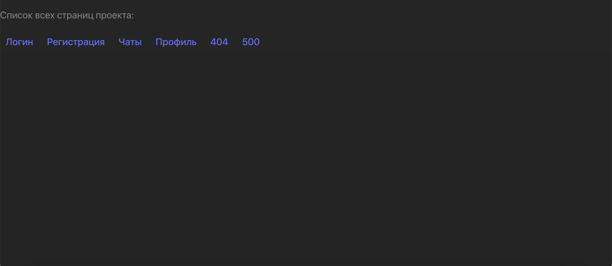

### Мессенджер для Яндекс Практикума

---
Ссылка на макет в фигме: https://www.figma.com/file/p1uOS3VoMQaRne9jpeOxJY/Untitled
Ссылка на задеплоеный проект https://messenger-jcbf.onrender.com/

## Установка

Лучше всего пользователя убеждает собственный опыт. Чем быстрее он начнёт пользоваться проектом, тем раньше почувствует пользу. Для этого помогите ему установить приложение: напишите краткую пошаговую инструкцию.

Если проект предназначен для разработчиков, добавьте информацию об установке тестовых версий. Например:

- `npm install` — установка стабильной версии,
- `npm run dev` — запуск версии для разработчика,
- `npm start` — запуск версии для сборки статики на Express,
- `npm run build` — сборка стабильной версии.

## **Примеры использования**
